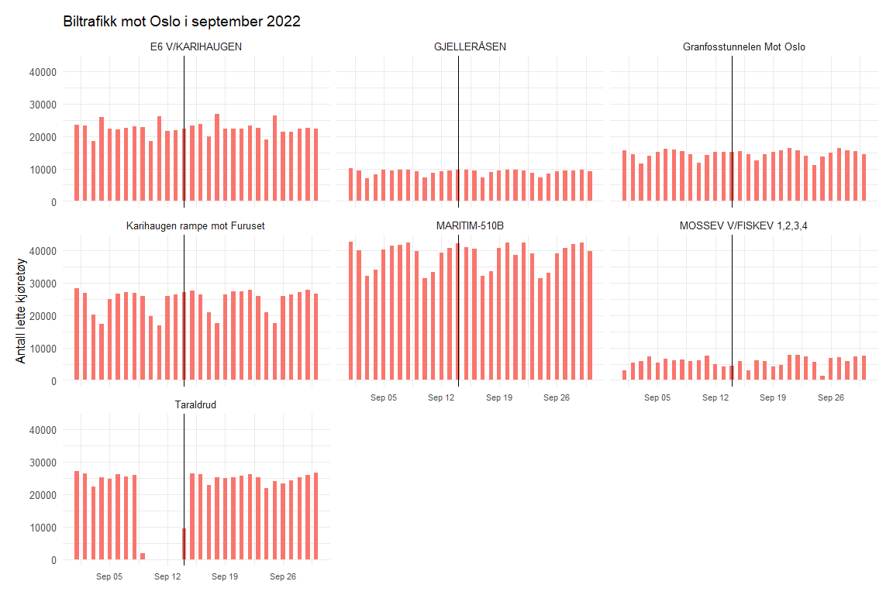
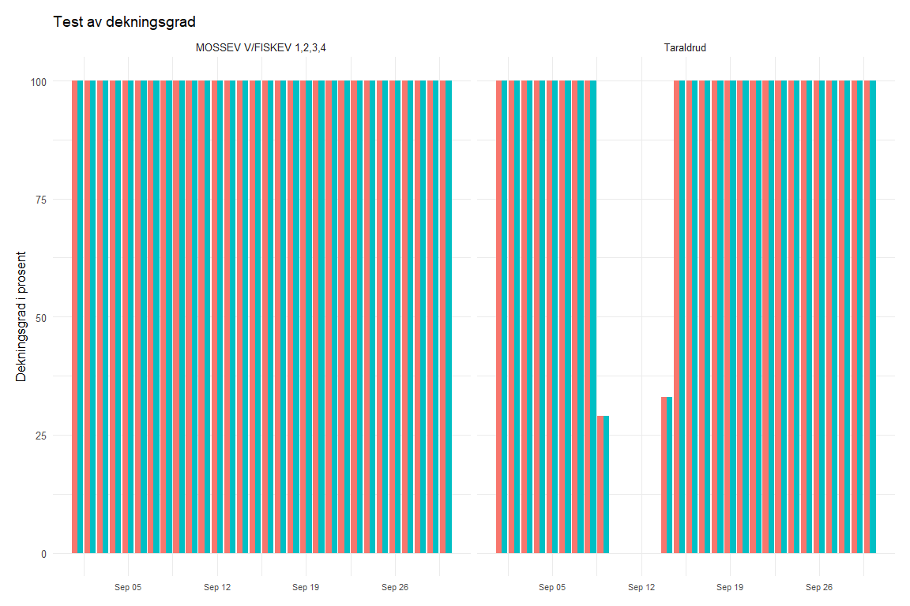
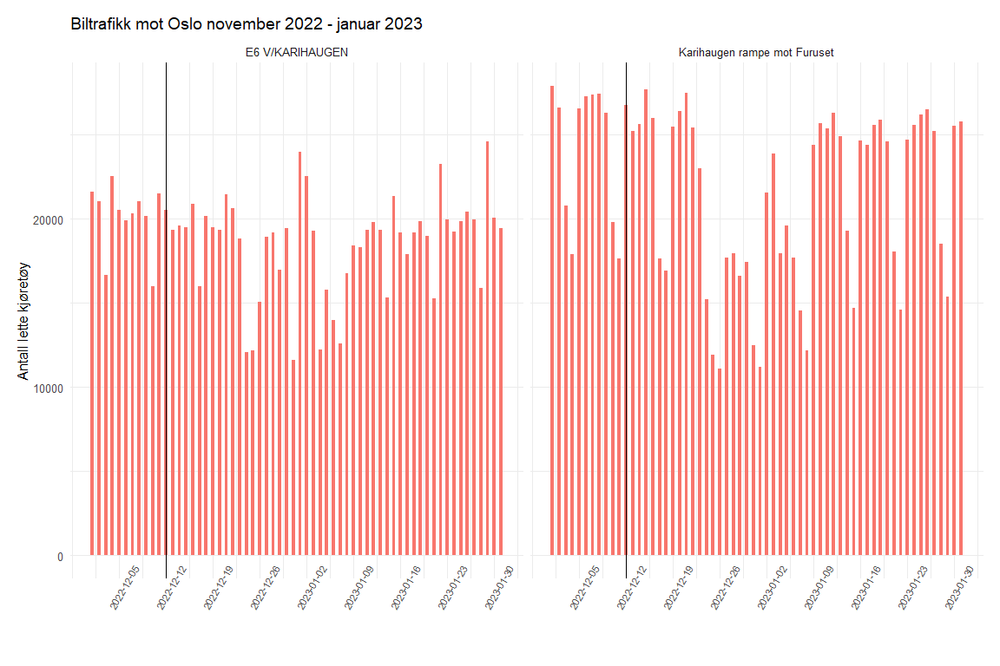
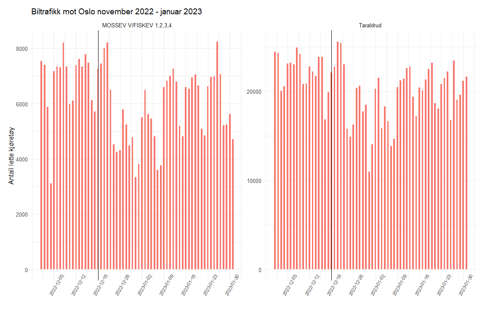

# Does car traffic spike after major disruptions on the railway?

**Author:** Aga Sadlowska · **Date:** 01/2023

> Full R Markdown source: [`biltrafikk_etter_hendelser.Rmd`](biltrafikk_etter_hendelser.Rmd) · Full rendered PDF report: [`biltrafikk_etter_hendelser.pdf`](biltrafikk_etter_hendelser.pdf)

## The aim of the project

The aim of this project is to check for a short-term behavioral response to bad news about the railway: does car traffic on the roads into Oslo rise in the days or weeks after a major, heavily-reported rail incident? The logic behind the expectation is straightforward — incidents that cause delays and cancellations and draw a lot of media attention could damage the railway's reputation and reduce commuters' trust in it, which in turn could push some of them into their cars.

## Data

Car traffic volume data is published by the Norwegian Public Roads Administration (Statens vegvesen) and can be downloaded as CSV for a chosen location and time period from their [traffic data portal](https://www.vegvesen.no/trafikkdata/start/kart). Vehicles are counted continuously, around the clock, at fixed sensor points, which also register vehicle length and direction of travel — 5.6 metres is the cutoff used here between light and heavy vehicles.

Two datasets were used: one covering daily traffic for all of 2022 at the selected sensor points ([`trafikkmengdeOslo2022.csv`](trafikkmengdeOslo2022.csv)), and one covering 1 November 2022 – 31 January 2023 at the same points ([`desemberkatastrofer.csv`](desemberkatastrofer.csv)), used to zoom in on the two December incidents. Both datasets combine counts from the main approach roads into and out of Oslo:

- From the south — Taraldrud and Mosseveien by Fiskevollbukta
- From the east — E6 at Karihaugen and the Karihaugen ramp toward Furuset
- From the north — Gjelleråsen
- From the west — Maritim-510B and the Granfoss tunnel toward Oslo

Oslo was chosen because of three incidents that caused major disruption on the railway and were widely covered in the media: a ground fault at Oslo Central Station on 14 September 2022, a fallen overhead contact wire in the Romeriksporten tunnel on 12 December 2022, and the closure of the Follo Line on 19 December 2022. The sensor points were chosen as plausible commuting routes for people who have the train as a realistic alternative to driving.

## Method

For each incident, a bar chart of daily light-vehicle traffic was plotted with a vertical line marking the incident date. The reasoning: if a rail incident really does push people toward their cars, that should show up as a visible bump in car traffic in the days immediately following. Only light vehicles were plotted, to isolate private commuters as far as possible from freight traffic.

### Ground fault at Oslo S, 14 September 2022

This was tested first, across all seven sensor points for the month of September:

The pattern is a clear, regular weekly rhythm with no visible break after 14 September. The irregular-looking dip at Taraldrud in the days around the incident turned out to be a data-quality artifact rather than a traffic effect — a check of the coverage-rate variable (which flags how much of the reporting period has good-quality data) showed a drop right around 12 September at that sensor:

Mosseveien was checked for the same reason, given its comparatively irregular traffic pattern, but no coverage issue was found there, and its traffic pattern doesn't appear to be affected by the incident either.

### Romeriksporten and the Follo Line, December 2022

The same test was run on the two December incidents, using the November 2022 – January 2023 dataset. The conclusion is the same: no detectable rise in car traffic follows either incident.

The dominant pattern visible in both charts is a drop in traffic tied to the Christmas holidays, not to either incident — a reminder that both events happened close enough to the holiday period to make the underlying signal harder to isolate.

## Conclusion

Across all three incidents, car traffic on the roads into Oslo stayed on its normal weekly rhythm — no rise is detectable in the days or weeks after any of them. A likely explanation is that the train simply accounts for a small share of overall travel in the Oslo area compared to cars, so even if some commuters did switch, they may be too few to register in the data — though confirming that would require comparing across all transport modes, including bus and possibly bike. It's also plausible that the effect of rail disruptions is further muted by widespread use of home-office days, which give commuters a third option beyond "drive" or "take the train."

---

*Data from the Norwegian Public Roads Administration's [traffic data portal](https://www.vegvesen.no/trafikkdata/); visualization with [ggplot2](https://ggplot2.tidyverse.org/). See [`biltrafikk_etter_hendelser.Rmd`](biltrafikk_etter_hendelser.Rmd) for the complete, runnable source.*
