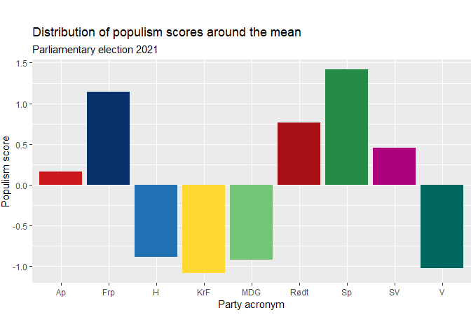

# Levels of populist rhetoric among Norwegian mainstream parties now and in the last decade

**Author:** Aga Sadlowska · **Date:** 19.05.2022

> Full R Markdown source: [`pop.Rmd`](pop.Rmd) · Full rendered report with output: [`pop.pdf`](pop.pdf)

## The project

The aim of this project is to assess the levels of populist rhetoric in the Norwegian public debate now, and analyze the development of such levels in the last decade. Populism has been on the rise all over the Western world, and its presence in the political mainstream has increased. Although Norway has been spared the more radical and dangerous variants, like Donald Trump or the Eastern European right, the discourse leading up to the 2021 parliamentary election was marked by politicians presenting themselves as representatives of the real people who know where the shoe pinches, as opposed to detached elites making their lives harder with decisions hatched in some posh bureau in the capital.

Sentiment analysis is used here to examine whether populist tendencies can be traced in the Norwegian parties' communication with voters. The object of analysis were party manifestos adopted for the 2009, 2013, 2017 and 2021 parliamentary elections. To examine the impact of populism in the mainstream debate, the analysis is limited to the 9 parties that held seats in the Norwegian parliament through one or more of those four periods. The manifestos were obtained in PDF format from the parties' web pages and the Norwegian Centre for Research Data.

## The dictionary

The first step was to create a dictionary of words that define populist rhetoric. This was more of an interpretative than a technical exercise — the code itself is very simple, but the choice of words is not necessarily obvious. According to Pippa Norris and Ronald Inglehart's minimal definition, populism is a style of rhetoric claiming that legitimate power rests with "the people," not elites. It challenges the legitimate authority of the establishment and regards the voice of ordinary citizens as the only genuine form of democratic governance, even when at odds with expert judgment, because lived experience is considered superior to formal education (Norris & Inglehart, 2019, *Cultural Backlash: Trump, Brexit and Authoritarian Populism*).

Based on this definition, words and phrases like "the people" and "elites" seem like a good choice for a populist dictionary. However, no word is populist in itself — context defines populism, not words alone. The dictionary therefore includes words related to Norris and Inglehart's minimal definition, as well as words related to the concept of *centralization*, a product of the ever-salient Norwegian conflict between periphery and center, which paints a picture of Oslo-based bureaucrats and urban elites in opposition to the "real people" in the rural districts. This divide, and the rhetorical construct of "ordinary people," were actively exploited in the 2021 parliamentary election by several major parties — most notably the agrarian Center Party (Senterpartiet), but also the Labor Party (Arbeiderpartiet) and the Progress Party (Fremskrittspartiet), who competed with the agrarians for the same groups of voters.

```r
wordlist_populism <- dictionary(
  x = list(match_populism = c("vanlige folk*", "folk flest", "folket*",
                               "elite*", "folkelig*", "ekspert*", "byråkrat*",
                               "sentraliser*", "desentraliser*", "folkeavstemning*")))
```

The dictionary is a tool that enables automatic counting of the chosen words in a text. Naturally, simply counting words does not account for the individual context in which each word is used, so some overestimation of the populism signal is expected. The word list was kept parsimonious to limit this risk; the resulting bias should be roughly random rather than systematically favoring one party, so comparisons between texts should still be valid.

## Sentiment analysis

### General remarks

The parties included in the analysis are those who held seats in parliament through one or more of the periods starting in 2009, 2013, 2017 and 2021:

- The social democratic Labor Party (Arbeiderpartiet, Ap)
- The populist right Progress Party (Fremskrittspartiet, Frp)
- The conservative Høyre (H)
- The Christian democratic Christian People's Party (Kristelig Folkeparti, KrF)
- The environmentalist Green Party (Miljøpartiet De Grønne, MDG)
- The communist Red (Rødt)
- The agrarian Center Party (Senterpartiet, Sp)
- The Socialist Left (Sosialistisk Venstreparti, SV)
- The liberal Venstre (V)

The analyzed documents are working manifestos adopted by the parties for each parliamentary period: 2009–2013, 2013–2017, 2017–2021, and the current period, 2021–2025.

### Sentiment analysis of the current manifestos

The first part of the analysis builds a bar plot comparing the levels of populist rhetoric in party manifestos at the time of the 2021 election. The manifestos are read into R and turned into a corpus:

```r
files_21 <- Sys.glob((paths = "./data/*prog21.pdf"))
texts_21 <- readtext(files_21)

corpus_21 <-
  corpus(x = texts_21$text) %>%
  tokens(remove_punct = TRUE, remove_numbers = TRUE) %>%
  tokens_select(pattern = stopwords('no'), selection = 'remove') %>%
  tokens_wordstem(language = quanteda_options('language_stemmer'))
```

The words defining populist rhetoric are then counted using the dictionary:

```r
popu_list_21 <- tokens_lookup(
  x = corpus_21,
  dictionary = wordlist_populism,
  exclusive = TRUE)
```

#### The populism score

Since manifesto length varies, the absolute word count can't be used directly to score each manifesto's level of populism — it must be weighted relative to total document length, and then scaled so the result sits on an interpretable scale centered on the mean (one unit = one standard deviation):

```r
scores_21 <- c(ntoken(popu_list_21))
doc_length_21 <- c(ntoken(corpus_21))

weights_21 <- doc_length_21 / sum(doc_length_21)
weights_21 <- 1 - weights_21

weighted_scores_21 <- scores_21 * weights_21

scaled_variable_21 <- scale(weighted_scores_21, center = TRUE, scale = TRUE)
```

The results are plotted as a bar chart showing the distribution of populism scores around the mean, by party:



### The development of populist rhetoric over time

The next step analyzes party manifestos across all four parliamentary periods (2009–2021), to assess whether populism became more or less prevalent overall, and whether each party individually uses more or less populist rhetoric than before. The reading, counting, and scoring code is identical to the single-year case above, just run across all 36 manifestos instead of 9, so it isn't repeated here — only the resulting data:


Averaging across all parties for each election year shows the overall trend:


## Conclusion

From the results of the sentiment analysis:

1. There is a degree of polarization in the Norwegian public debate right now, with the parties using the most populist rhetoric being approximately twice as populist as the ones using the least populist rhetoric.
2. The speed and direction of development of populist rhetoric over time vary from party to party and from year to year. However, the Progress Party, the Center Party, and Red consistently keep their positions above the mean, whereas the conservatives, the Christian democrats, the greens, and the liberals stay under the mean throughout the whole analysis period.
3. The level of populist rhetoric has increased since the 2009 parliamentary election, although the development is not linear.

Worth noting: the Labor Party, positioned under the mean in 2009, 2013 and 2017, made a somewhat sharp turn toward more populist rhetoric and ended up slightly above the mean in 2021 — possibly due to their competition with the Center Party for the same voter groups. These two parties ultimately formed a minority government coalition after the 2021 election.

---

*Analysis performed in R using [quanteda](https://quanteda.io/) for text analysis and [ggplot2](https://ggplot2.tidyverse.org/) for visualization. See [`pop.Rmd`](pop.Rmd) for the complete, runnable source.*
