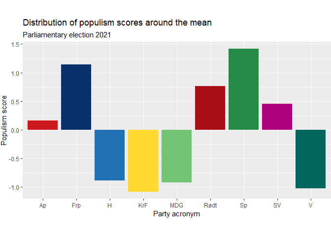

Levels of populist rhetoric among Norwegian mainstream parties now and
in the last decade
================
Aga Sadlowska
19.05.2022

# THE PROJECT

The aim of my project is to assess the levels of populist rhetoric in
the Norwegian public debate now, and analyze the development of such
levels in the last decade. Populism has been on the rise all over the
Western world, its presence in the political mainstream increased.
Although Norway has been spared for the more radical and dangerous
variants, like Donald Trump or the Eastern European right, the discourse
leading up to the 2021 parliamentary election was marked by politicians
presenting themselves as representatives of the real people who know
where the shoe pinches, as opposed to detached elites making their lives
harder with decisions hatched in some posh bureau in the capital. I have
used sentiment analysis to examine whether populist tendencies can be
traced in the Norwegian parties’ communication with the voters. The
object of analysis were party manifestos adopted for the 2009, 2013,
2017 and 2021 parliamentary elections. To examine the impact of populism
in the mainstream debate, I limited the analysis to the 9 parties that
held seats in the Norwegian parliament through one or more of those four
periods. I obtained the manifestos in pdf format from the web pages of
the parties and the Norwegian Centre for Research Data.

# THE DICTIONARY

My first step was to create a dictionary of words that define populist
rhetoric. This was more of an interpretative than a technical exercise,
as the code itself is very simple, but the choice of words is not
necessarily obvious. According to Pippa Norris and Ronald Inglehart’s
minimal definition, populism is a style of rhetoric claiming that
legitimate power rests with “the poeple” not elites. It challenges the
legitimate authority of the establishment and regards the voice of
ordinary citizens as the only genuine form of democratic governance,
even when at odds with expert judgment, because lived experience is
considered superior to formal education (Pippa Norris and Ronald
Inglehart 2019, *Cultural Backlash. Trump, Brexit and Authoritarian
Populism*). Based on this definition, words and phrases like “the
people” and “elites” seem like a good choice for a populist dictionary.
However, no word is populist in itself. Saying “The people standing over
there are wearing yellow vests” is obviously just a statement of a fact,
not populism. Politicians saying “The people demand change”, however,
present themselves as ambassadors of the true will of the citizens and
fit Norris and Inglehart’s minimal criteria. It is the context that
defines populism, not words or phrases, but in different political
realities, some words and phrases are more frequently used in populist
contexts than others. Identifying them requires one to be fairly versed
in the relevant public debate, as debates in different countries have
their own special context. In my dictionary, I decided to include words
related to Norris and Inglehart’s minimal definition, and words related
to the concept of centralization. This concept is a product of the
ever-salient Norwegian conflict between periphery an center, and paints
a picture of Oslo-based bureaucrats and urban elites in opposition to
the “real people” in the rural districts. This divide and the more
obscure rhetorical construct of “ordinary people” were actively
exploited in the 2021 parliamentary election by several major parties,
mostly the agrarian Center Party (Senterpartiet), but also the Labor
Party (Arbeiderpartiet) and the Progress Party (Fremskrittspartiet), who
competed with the agrarians for the same groups of voters.

``` r
wordlist_populism <- dictionary(x = list(match_populism = c("vanlige folk*",
    "folk flest", "folket*", "elite*", "folkelig*", "ekspert*",
    "byråkrat*", "sentraliser*", "desentraliser*", "folkeavstemning*")))
```

The dictionary is a tool that enables to automatically count the chosen
words in a text. Naturally, simply counting the words does not consider
the individual context every time a word is used. It is therefore
probable that some overestimation of the sentiment will occur. I was
parsimonious with the number of words, as so not to add to this
potential problem, although the bias it creates is random and I do not
expect it to vary a lot between the individual texts. The comparison
between texts should therefore still be valid.

# SENTIMENT ANALYSIS

## General remarks

As stated before, the parties included in the analysis were those who
held seats in the parliament through one or more of the periods starting
in 2009, 2013, 2017 and 2021. These parties (and their acronyms) are:

-   The social democratic Labor Party (Arbeiderpartiet, Ap)
-   The populist right Progress Party (Fremskrittspartiet, Frp)
-   The conservative Høyre (H)
-   The christian democratic Christian People’s Party (Kristelig
    Folkeparti, KrF)
-   The environmentalist green party (Miljøpartiet De Grønne, MDG)
-   The communist Red (Rødt)
-   The agrarian Center Party (Senterpartiet, Sp)
-   The Socialist Left (Sosialistisk Venstreparti, SV)
-   The liberal Venstre (V)

The analyzed documents are working manifestos, that is programs adopted
by the parties for each parliamentary period. Periods analyzed are 2009
to 2013, 2013 to 2017, 2017 to 2021 and the current period 2021 to 2025.

## Sentiment analysis of the current manifestos

In the first part of my analysis, the final goal was to create a bar
plot that would allow to compare the levels of populist rhetoric in
party manifestos at the time of the latest election in 2021. The first
task was to import the documents into R, read them and create a corpus.

``` r
files_21 <- Sys.glob((paths = "./programmer/arb/*prog21.pdf"))

texts_21 <- readtext(files_21)

corpus_21 <- corpus(x = texts_21$text) %>%
    tokens(remove_punct = TRUE, remove_numbers = TRUE) %>%
    tokens_select(pattern = stopwords("no"), selection = "remove") %>%
    tokens_wordstem(language = quanteda_options("language_stemmer"))
```

The next task was to count the words defining populist rhetoric using
the previously created dictionary.

``` r
popu_list_21 <- tokens_lookup(x = corpus_21, dictionary = wordlist_populism,
    exclusive = TRUE)

popu_list_21
```

    ## Tokens consisting of 9 documents.
    ## text1 :
    ##  [1] "match_populism" "match_populism" "match_populism" "match_populism"
    ##  [5] "match_populism" "match_populism" "match_populism" "match_populism"
    ##  [9] "match_populism" "match_populism" "match_populism" "match_populism"
    ## [ ... and 34 more ]
    ## 
    ## text2 :
    ##  [1] "match_populism" "match_populism" "match_populism" "match_populism"
    ##  [5] "match_populism" "match_populism" "match_populism" "match_populism"
    ##  [9] "match_populism" "match_populism" "match_populism" "match_populism"
    ## [ ... and 61 more ]
    ## 
    ## text3 :
    ##  [1] "match_populism" "match_populism" "match_populism" "match_populism"
    ##  [5] "match_populism" "match_populism" "match_populism" "match_populism"
    ##  [9] "match_populism" "match_populism" "match_populism" "match_populism"
    ## [ ... and 5 more ]
    ## 
    ## text4 :
    ##  [1] "match_populism" "match_populism" "match_populism" "match_populism"
    ##  [5] "match_populism" "match_populism" "match_populism" "match_populism"
    ##  [9] "match_populism" "match_populism" "match_populism" "match_populism"
    ## 
    ## text5 :
    ##  [1] "match_populism" "match_populism" "match_populism" "match_populism"
    ##  [5] "match_populism" "match_populism" "match_populism" "match_populism"
    ##  [9] "match_populism" "match_populism" "match_populism" "match_populism"
    ## [ ... and 5 more ]
    ## 
    ## text6 :
    ##  [1] "match_populism" "match_populism" "match_populism" "match_populism"
    ##  [5] "match_populism" "match_populism" "match_populism" "match_populism"
    ##  [9] "match_populism" "match_populism" "match_populism" "match_populism"
    ## [ ... and 51 more ]
    ## 
    ## [ reached max_ndoc ... 3 more documents ]

As shown in the output, this code counts the words matching those
included in the dictionary in each text included in the corpus.

### The populism score

As the length of the manifestos varies, we cannot use the absolute
number of populist words to score each manifest’s levels of populism.
The absolute word count must be weighted relative to the total document
length. This was achieved with the code below.

``` r
scores_21 <- c(ntoken(popu_list_21))
scores_21
```

    ## text1 text2 text3 text4 text5 text6 text7 text8 text9 
    ##    46    73    17    12    17    63    81    54    13

``` r
doc_length_21 <- c(ntoken(corpus_21))
doc_length_21
```

    ## text1 text2 text3 text4 text5 text6 text7 text8 text9 
    ## 26294 28042 17614 20360 28821 28835 29405 27235 13328

``` r
weights_21 <- doc_length_21/sum(doc_length_21)
weights_21 <- 1 - weights_21
weights_21
```

    ##     text1     text2     text3     text4     text5     text6     text7     text8 
    ## 0.8804460 0.8724981 0.9199123 0.9074268 0.8689561 0.8688925 0.8663008 0.8761674 
    ##     text9 
    ## 0.9394000

``` r
weighted_scores_21 <- scores_21 * weights_21
weighted_scores_21
```

    ##    text1    text2    text3    text4    text5    text6    text7    text8 
    ## 40.50051 63.69236 15.63851 10.88912 14.77225 54.74023 70.17036 47.31304 
    ##    text9 
    ## 12.21220

Although this code solves the problem of weighting, the scale it returns
is not very intuitive, as the weighted scores are a product of
mathematical operations performed on numbers which are, in layman’s
terms, random. I chose therefore to scale the scores. Scaling a variable
returns a scale centered around the mean, where one scale unit equals
one standard deviation.

``` r
scaled_variable_21 <- scale(weighted_scores_21, center = TRUE,
    scale = TRUE)
scaled_variable_21
```

    ##             [,1]
    ## text1  0.1621345
    ## text2  1.1408989
    ## text3 -0.8871154
    ## text4 -1.0875536
    ## text5 -0.9236739
    ## text6  0.7630924
    ## text7  1.4142897
    ## text8  0.4496432
    ## text9 -1.0317158
    ## attr(,"scaled:center")
    ## [1] 36.65873
    ## attr(,"scaled:scale")
    ## [1] 23.69503

To compare the levels of populism, I chose to present the results with a
bar plot using a data frame of the scaled scores. The plot shows the
distribution of populism scores around the mean by party.

    ##   partyID      score
    ## 1      Ap  0.1621345
    ## 2     Frp  1.1408989
    ## 3       H -0.8871154
    ## 4     KrF -1.0875536
    ## 5     MDG -0.9236739
    ## 6    Rødt  0.7630924
    ## 7      Sp  1.4142897
    ## 8      SV  0.4496432
    ## 9       V -1.0317158



## The development of populist rhetoric in time

My next goal was to analyse the party manifestos for the four
parliamentary periods from 2009 to the current one, to assess whether
populism became more or less prevalent in the parties’ communication
overall, and whether each individual party uses more or less populist
rhetoric than it did before. The code for reading, counting words and
scoring the results is the same regardless of whether the number of
documents is nine or thirty-six, and so I will not repeat it in the
output. The data frames are slightly different. Naturally, I needed to
include a year variable, and I also included the absolute scores, which
I used in the presentation of the overall tendency for all parties as a
total. In this presentation, I also had to drop repeating rows of the
year variable from the overall data frame. Since it is an assessment of
a development in time, I chose to present the results with a line graph.

The data frame and plot assessing the development in time by party:

    ##        partyID year     score scaled_score
    ## text1       Ap 2009 15.696744   -0.9707275
    ## text2       Ap 2013 17.494304   -0.8948510
    ## text3       Ap 2017 24.360153   -0.6050376
    ## text4       Ap 2021 44.546034    0.2470255
    ## text5      Frp 2009 71.300924    1.3763721
    ## text6      Frp 2013 65.105767    1.1148693
    ## text7      Frp 2017 72.742640    1.4372282
    ## text8      Frp 2021 70.539226    1.3442202
    ## text9        H 2009 15.747809   -0.9685720
    ## text10       H 2013 11.811362   -1.1347328
    ## text11       H 2017 15.647853   -0.9727912
    ## text12       H 2021 16.640046   -0.9309099
    ## text13     KrF 2009 26.161353   -0.5290075
    ## text14     KrF 2013 20.075134   -0.7859120
    ## text15     KrF 2017 24.729284   -0.5894563
    ## text16     KrF 2021 11.706303   -1.1391674
    ## text17     MDG 2009  9.933728   -1.2139893
    ## text18     MDG 2013 24.497703   -0.5992315
    ## text19     MDG 2017 16.582540   -0.9333373
    ## text20     MDG 2021 16.411024   -0.9405771
    ## text21    Rødt 2009 50.892026    0.5148952
    ## text22    Rødt 2013 49.963176    0.4756877
    ## text23    Rødt 2017 48.018562    0.3936039
    ## text24    Rødt 2021 60.816263    0.9338057
    ## text25      Sp 2009 89.240107    2.1336003
    ## text26      Sp 2013 58.874187    0.8518290
    ## text27      Sp 2017 62.348298    0.9984742
    ## text28      Sp 2021 78.136837    1.6649218
    ## text29      SV 2009 29.075022   -0.4060190
    ## text30      SV 2013 77.305687    1.6298383
    ## text31      SV 2017 45.673808    0.2946298
    ## text32      SV 2021 52.232087    0.5714603
    ## text33       V 2009 22.432824   -0.6863919
    ## text34       V 2013 29.997869   -0.3670649
    ## text35       V 2017 33.450309   -0.2213344
    ## text36       V 2021 12.791720   -1.0933510


The data frame and plot assessing the development in time for all
parties taken together:

    ## # A tibble: 4 x 2
    ## # Groups:   year [4]
    ##   year  mean_year
    ##   <chr>     <dbl>
    ## 1 2009       36.7
    ## 2 2013       39.5
    ## 3 2017       38.2
    ## 4 2021       40.4


# CONCLUSION

From the results of the sentiment analysis we can conclude as follows:

1.  There is a degree of polarization in the Norwegian public debate
    right now, with the parties using the most populist rhetoric being
    approximately twice as populist as the ones using the least populist
    rhetoric.
2.  The speed and direction of development of populist rhetoric in time
    vary from party to party and from year to year in the period of
    analysis. However, it is shown that Progress Party, Center Party and
    Red consequently keep their positions above the mean, whereas the
    conservatives, the Christian democrats, the greens and the liberals
    stay under the mean throughout the whole analysis period.
3.  The level of populist rhetoric has increased since the 2009
    parliamentary election, although the development is not linear.

I find it worth noting that the Labor Party, positioned under the mean
in 2009, 2013 and 2017 made a somewhat sharp turn to more populist
rhetoric and ended up slightly above the mean in 2021. My interpretation
is that this might be due to their competition with the Center Party for
the same voter groups. These two parties ultimately formed a minority
government coalition after the 2021 election.
