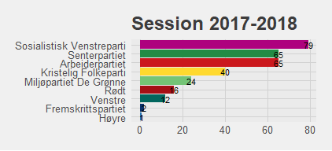
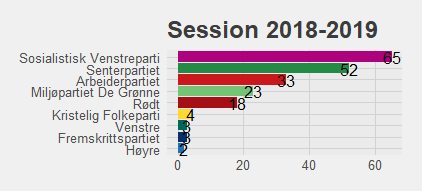
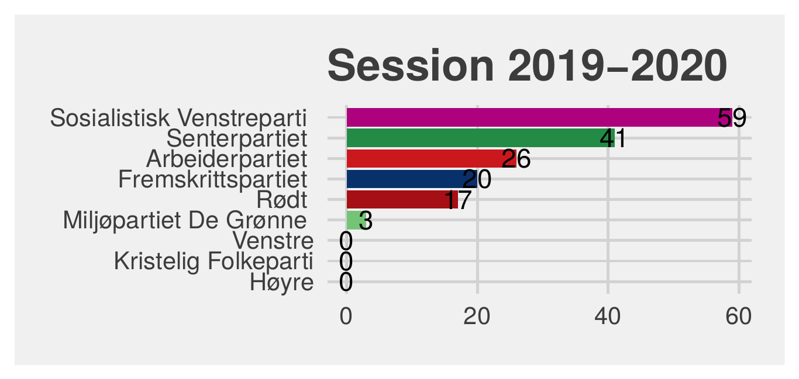
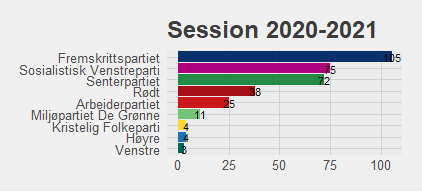
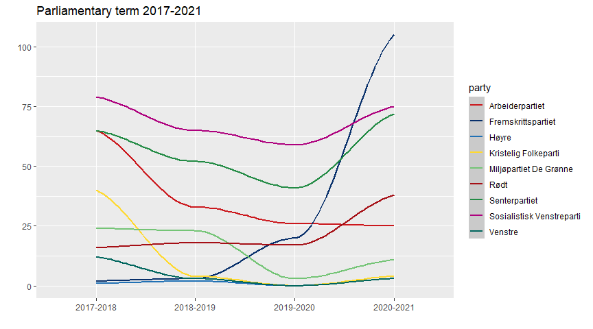
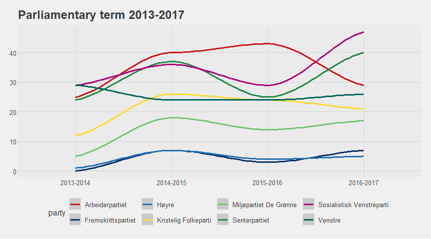

# Do Norwegian MPs submit more MP proposals when their party is in opposition?

**Author:** Aga Sadlowska · **Date:** 27.05.2021

> Full R Markdown source: [`props.Rmd`](props.Rmd) · Full rendered PDF report: [`props.pdf`](props.pdf)

## The aim of the project

The aim of this project is to assess if the number of MP proposals submitted to the Norwegian parliament in the last two terms by MPs from different parties is correlated with whether their party has been part of the incumbent prime minister Erna Solberg's government coalition. The expectation is to find more activity on the part of MPs from opposition parties than the ones from parties forming the Solberg Cabinet, because without their own people in governmental positions, the parliament is the best arena for political parties to influence policy and mark and communicate their stance.

## The political situation

The Solberg Cabinet took office in October 2013 after the 2013 parliamentary election and held power after the 2017 parliamentary election, governing through two parliamentary terms. In the first term, 2013–2017, it was a minority government formed by the prime minister's party Høyre and her coalition partner, Fremskrittspartiet, supported by Venstre and Kristelig Folkeparti through a binding cooperation agreement signed at the start of the term.

The second term, 2017–2021, was more eventful:

- Kristelig Folkeparti decided not to sign a new cooperation agreement at the beginning of the term.
- Venstre started coalition negotiations with Høyre and Fremskrittspartiet and joined the cabinet in January 2018.
- In January 2019, Kristelig Folkeparti joined the coalition as well, making the government a majority coalition.
- In January 2020, Fremskrittspartiet left the coalition in an atmosphere of conflict, disagreeing with the three other partners' decision to bring a former female Norwegian ISIS member back to Norway from the al-Hol refugee camp to secure medical treatment for her children.

## Data

The data comes from Stortinget's website, where MP proposals can be sorted by party, with the number of proposals shown next to each party's name, one page per session. Data was collected by web scraping four separate URLs per parliamentary term. The 2017–2021 term was analyzed first, as it was expected to show more interesting variation given the mid-term coalition changes above.

It's worth noting that the data shows the number of proposals each party's MPs *contributed to submitting*, not the number of proposals submitted by each party — a single proposal is often submitted by MPs from more than one party, so it can appear in more than one party's count. The numbers still reveal which party's MPs have been the most active, which is the actual research question here.

## Analysis of the 2017–2021 term

Four bar plots, one per session, visualize the number of proposals each party's MPs contributed to submitting:

The plots support the expectation that opposition MPs are more active. Sosialistisk Venstreparti, Senterpartiet and Arbeiderpartiet — three parties that ruled together from 2005 to 2013 and are perceived as a left-wing alternative to the Solberg Cabinet — top every graph, together with Rødt. That held until Fremskrittspartiet awakened in the 2019–2020 session (half of which they spent in opposition) and topped the graph with 105 proposals in 2020–2021, once they were fully outside the coalition. Venstre, who spent half of 2017–2018 in opposition, was markedly more active that session (12 proposals) than in any that followed. Kristelig Folkeparti, who didn't join the cabinet until January 2019, contributed to 40 proposals in 2017–2018 before going quiet in later sessions.

The sharp rise in Fremskrittspartiet's activity is especially striking as a line chart:

## Test on the 2013–2017 term

To test these expectations against the earlier term, a single line chart visualizes the overall tendencies — a less detailed approach than the bar-plot breakdown, since this term was expected to be (and turned out to be) less eventful:

The two coalition parties (Høyre and Fremskrittspartiet) sit markedly lower than the opposition throughout. The sharp rise in activity from Sosialistisk Venstreparti and Senterpartiet MPs in the last session before the 2017 election is also worth noting. The two parties merely *supporting* the Solberg Cabinet under a cooperation agreement (Venstre and Kristelig Folkeparti) were still far more active than the coalition parties themselves.

## Conclusions

The data from both the 2013–2017 and 2017–2021 terms supports the expectation that MPs from opposition parties are more active in submitting MP proposals than their colleagues from parties forming the governing coalition. The most important factor appears to be whether a party actually participates in forming the cabinet, rather than whether it merely supports the cabinet in parliament — whether that support is structured by a binding agreement or not doesn't seem to matter much, as the 2013–2017 term shows. It is joining or leaving the coalition itself that immediately shows up in MPs' activity levels.

---

*Data collected via web scraping (rvest) from [stortinget.no](https://www.stortinget.no/); visualization with [ggplot2](https://ggplot2.tidyverse.org/) and [ggthemes](https://jrnold.github.io/ggthemes/). See [`props.Rmd`](props.Rmd) for the complete, runnable source.*
